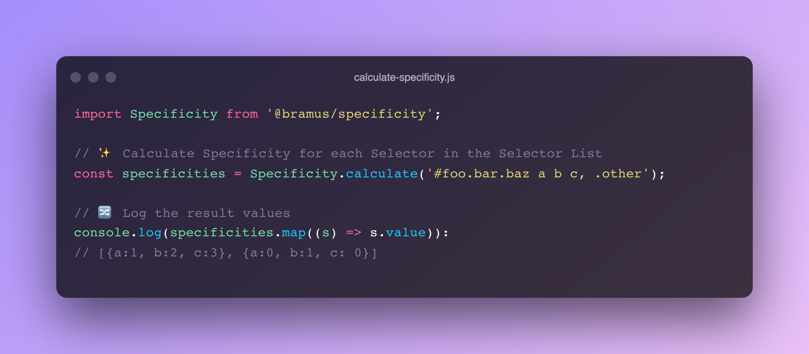

# Specificity

Package to calculate the Specificity of CSS Selectors. Also includes some convenience functions to compare, sort, and filter an array of specificity values.

Supports [Selectors Level 4](https://www.w3.org/TR/selectors-4/), including those special cases `:is()`, `:where()`, `:not()`, etc.

## Installation

```bash
npm i @bramus/specificity
```

## Usage / Example

This library comes as an ES Module and exposes a `calculate` function which calculates the specificity of a given CSS SelectorList.

```js
import Specificity from '@bramus/specificity';
const specificities = Specificity.calculate('header:where(#top) nav li:nth-child(2n + 1), #doormat');
```

Because `calculate` accepts a [Selector List](https://www.w3.org/TR/selectors-4/#grouping) — which can contain more than 1 [Selector](https://www.w3.org/TR/selectors-4/#selector) — it will always return an array.

```js
import Specificity from '@bramus/specificity';
const specificities = Specificity.calculate('header:where(#top) nav li:nth-child(2n + 1), #doormat');
specificities.map((s) => s.toString()); // ["(0,1,3)","(1,0,0)"]
```

If you know you’re passing only a single Selector into `calculate()`, you can use JavaScript’s built-in destructuring to keep your variable names clean.

```js
import Specificity from '@bramus/specificity';
const [specificity] = Specificity.calculate('header:where(#top) nav li:nth-child(2n + 1)');
specificity.toString(); // "(0,1,3)"
```

## The Return Format

A calculated specificity is represented as an instance of the `Specificity` class, which also comes with `@bramus/specificity`.

The `Specificity` class includes methods to get the specificity value in a certain format, along with some convenience methods to compare it against other instances.

```js
import Specificity from '@bramus/specificity';

// ✨ Calculate specificity for each Selector in the given Selector List
const specificities = Specificity.calculate('header:where(#top) nav li:nth-child(2n + 1), #doormat');

// 🚚 The values in the array are instances of a Specificity class
const specificity = specificities[0]; // Instance of Specificity

// 🛠 From an instance you can get the value in various formats
specificity.value; // { a: 0, b: 1, c: 3 }
specificity.a; // 0
specificity.b; // 1
specificity.c; // 3
specificity.toString(); // "(0,1,3)"
specificity.toArray(); // [0, 1, 3]
specificity.toObject(); // { a: 0, b: 1, c: 3 }

// 💡 From an instance you can also get the selector (as a String)
specificity.selectorString(); // "header:where(#top) nav li:nth-child(2n + 1)"

// 💻 These instances also play nice with JSON.stringify()
console.log(JSON.stringify(specificity));
// {
//    "selector": 'header:where(#top) nav li:nth-child(2n + 1)',
//    "asObject": { "a": 0, "b": 1, "c": 3 },
//    "asArray": [0, 1, 3],
//    "asString": "(0,1,3)",
// }

// 🔀 Need to compare against another instance? That's possible!
specificity.isEqualTo(specificities[1])); // false
specificity.isGreaterThan(specificities[1])); // false
specificity.isLessThan(specificities[1])); // true
```

## Static Specificity Functions

This package also exposes some utility functions to work with specificities. These are all exposed as static functions on the Specificity class.

-   Comparison functions:

    -   `Specificity.compare(s1, s2)`: Compares s1 to s2. Returns a value that can be:
        -   `> 0` = Sort s2 before s1 _(i.e. s1 is more specific than s2)_
        -   `0` = Keep original order of s1 and s2 _(i.e. s1 and s2 are equally specific)_
        -   `< 0` = Sort s1 before s2 _(i.e. s1 is less specific than s2)_
    -   `Specificity.equals(s1, s2)`: Returns `true` if s1 and s2 have the same specificity. If not, `false` is returned.
    -   `Specificity.greaterThan(s1, s2)`: Returns `true` if s1 has a higher specificity than s2. If not, `false` is returned.
    -   `Specificity.lessThan(s1, s2)`: Returns `true` if s1 has a lower specificity than s2. If not, `false` is returned.

-   Sorting functions:

    -   `Specificity.sortAsc(s1, s2, …, sN)`: Sorts the given specificities in ascending order _(low specificity to high specificity)_
    -   `Specificity.sortDesc(s1, s2, …, sN)`: Sorts the given specificities in descending order _(high specificity to low specificity)_

-   Filter functions:
    -   `Specificity.min(s1, s2, …, sN)`: Filters out the value with the lowest specificity
    -   `Specificity.max(s1, s2, …, sN)`: Filters out the value with the highest specificity

A specificity passed into any of these utility functions can be any of:

-   An instance of the included `Specificity` class
-   A simple Object such as `{'a': 1, 'b': 0, 'c': 2}`

## Standalone Utility Functions

All static functions the Specificity class contains are also exported from as standalone functions using [Subpath Exports](https://nodejs.org/api/packages.html#subpath-exports).

If you're only interested in including some of these functions into your project you can import them from their Subpath. As a result, your bundle size will be reduced greatly _(except for including the standalone `calculate`, as it returns an array of Specificity instances that relies on the whole lot)_

```js
import { calculate } from '@bramus/specificity/core';
import { compare, equals, greaterThan, lessThan } from '@bramus/specificity/compare';
import { min, max } from '@bramus/specificity/filter';
import { sortAsc, sortDesc } from '@bramus/specificity/sort';
```

## License

`@bramus/specificity` is released under the MIT public license. See the enclosed `LICENSE` for details.

## Acknowledgements

The idea to create this package was sparked by [the wonderful Specificity Calculator created by Kilian Valkhof / Polypane](https://polypane.app/css-specificity-calculator/), a highly educational tool that not only calculates the specificity, but also explains which parts are responsible for it.

The heavy lifting of doing the actual parsing is done by [CSSTree](https://github.com/csstree/csstree).
